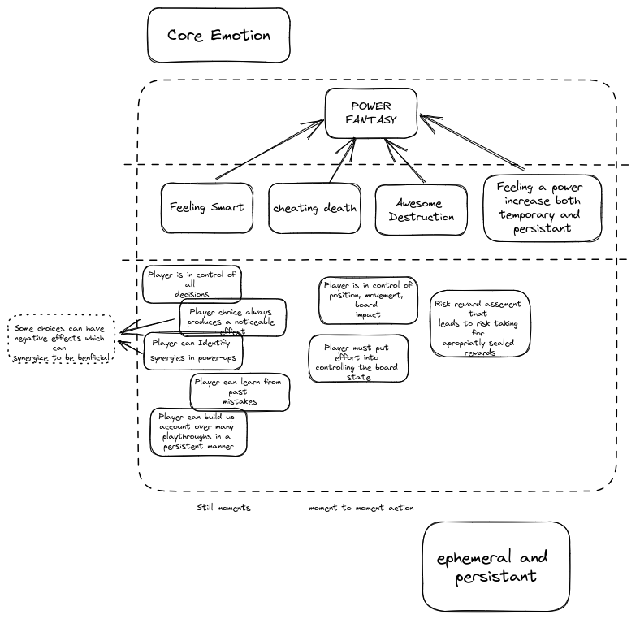

## PLAYER STORY

* Title screen (Start, Options, Upgrades)
* On upgrade screen, they can purchase attribute upgrades with persistent caps
* On options screen player can set SFX and Music levels
* Press start
* Player select character (one character)
* Character starts with pipe gun
* Player loads into level
* Player character can move
* The world infinitely scrolls. (Impassables: Old dead trees, rocks, barrels)
* A trash enemy spawns. (Snapper)
* Enemy follows player.
* Player takes damage when hit by enemy.
* Player has a weapon that auto fires projectile.
* Projectile damages enemy when it collides with enemy and projectile despawns.
* Many of the same enemy type spawn.
* Enemies spawn of screen continuously during a wave.
* Enemies drop bottle caps when they die.
    * trash: 1 cap, elite: 3 caps, boss: 5 caps
* Player collects caps by walking over them
* Caps fill up experience meter
* Each successive level up requires increasing number of caps
* When player levels up game pauses and a shop opens
* In the shop, ephemeral upgrade options appear
* Player selects 1 of three upgrades
* At the end of n minutes, if the player is still alive, they beat the level

* If player runs out of health, they die and the level is over

* When the level is over, total_caps_collected x time_multiplier = caps (persistent)
* When the level is over, they go to title screen

